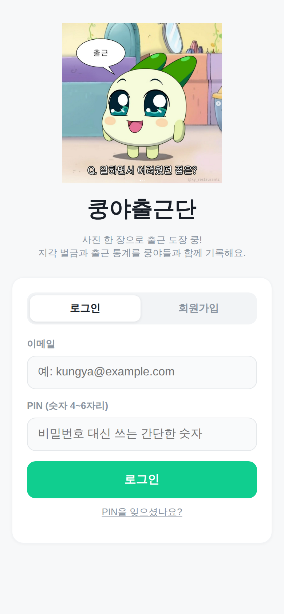
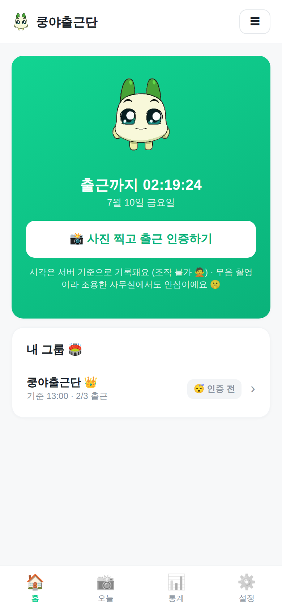
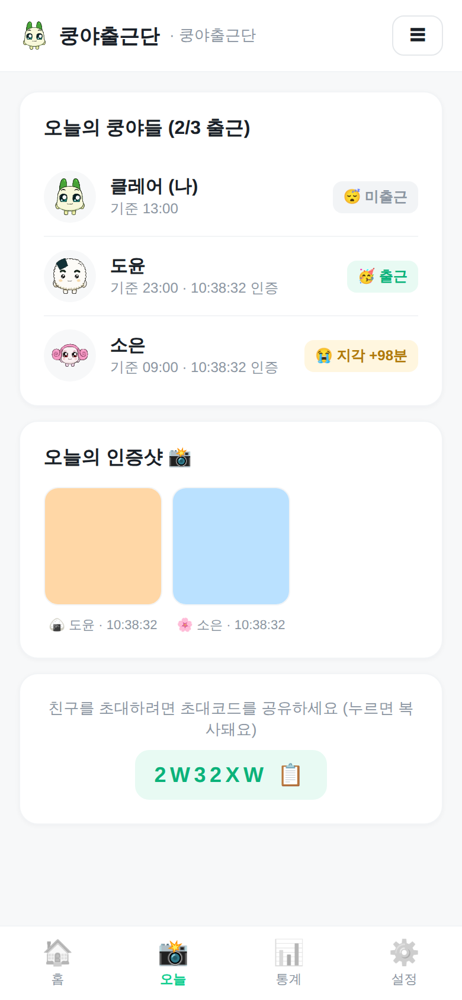
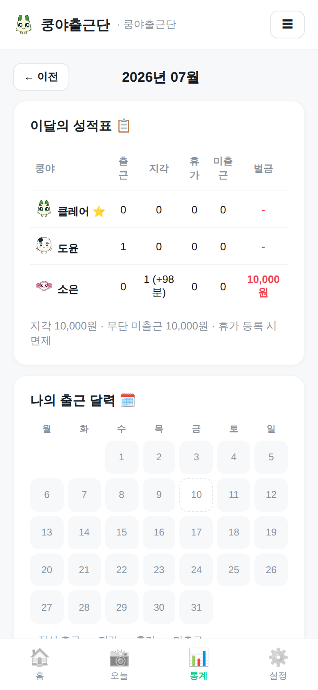

# 쿵야출근단 🥳

> 사진 한 장으로 출근 도장 쿵! 쿵야들과 함께 쓰는 출근 인증 · 지각 벌금 · 통계 웹앱

같은 그룹(로그)에 참여한 멤버들이 **사진으로 출근을 인증**하면 서버 타임스탬프가 찍히고,
멤버별 기준 시각으로 **지각을 판정**해 **벌금과 통계**를 기록합니다.

<p align="center">
  
  
  
  
</p>

## 주요 기능

- **홈 화면**: 인증 카드(상태별 쿵야 이미지 + 인증 전 남은 시간 카운트다운) 아래에
  내 그룹 목록 — 사진 한 장으로 여러 그룹을 체크해 한 번에 인증. 그룹을 누르면
  "오늘" 탭에서 그 그룹의 오늘 현황(멤버별 상태·인증샷)을 봄
- **탭 구성**: 홈 · 오늘 · 통계 · 설정. 계정 설정(닉네임·캐릭터·PIN)과 그룹
  관리(참여·만들기)는 오른쪽 위 ☰ 메뉴에서
- **그룹(로그)**: 그룹 생성 시 6자리 초대코드 발급, 초대코드로 참여
  — 그룹 화면의 초대코드는 누르면 클립보드에 복사
- **간편 로그인**: 이메일 + PIN(숫자 4~6자리), HMAC 서명 쿠키 세션
  — 이메일이 계정의 유니크 키(로그인 ID), 닉네임은 표시용이라 중복 사용 가능
- **PIN 오타 방지**: 가입·변경·재설정 시 PIN을 두 번 입력받아 일치 검증
- **PIN 재설정**: PIN을 잊으면 그룹 관리자가 임시 코드(6자리, 30분 유효)를 발급해
  전달 → 로그인 화면에서 코드로 새 PIN 설정. 관리자가 없거나 관리자 본인이 잊은
  경우엔 운영자에게 메일로 문의 (운영자는 `supabase/reset-pin.sql`로 초기화)
- **닉네임**: 2~20자, 비속어 필터 적용. 설정에서 언제든 변경 가능 (모든 그룹에 반영)
- **그룹 관리**: 관리자가 그룹 이름·벌금 변경, 그룹 삭제 가능
  (삭제 시 확인 후 멤버십·출근 기록·사진 등 모든 데이터가 함께 삭제)
- **그룹 나가기**: 누구나 그룹에서 나갈 수 있어요 — 나간 달까지의 통계·기록은
  그대로 보이고, 다음 달부터 통계·랭킹에서 제외 (나간 뒤 날짜엔 벌금이 쌓이지 않음,
  관리자가 나가면 가장 오래된 멤버에게 자동 위임)
- **무음 사진 인증**: 브라우저 내 카메라 스트림 캡처(getUserMedia + canvas) — 셔터음 없음,
  EXIF(GPS 등) 메타데이터 미포함. 권한 거부 시 기본 카메라 앱으로 폴백
- **서버 타임스탬프**: 인증 시각은 API 서버 수신 시각(KST) 기준 — 기기 시계 조작 불가
- **지각 판정**: 멤버별 기준 출근 시각 · 근무 요일 설정 가능
- **벌금**: 지각 1회 10,000원 · 무단 미출근 10,000원 (관리자가 금액 변경 가능)
- **휴가 등록**: 휴가/교육/아파요/출장 — 등록한 날짜는 벌금 면제
  (재택은 집에서 출근 인증이 가능하므로 사유에서 제외)
- **특정 일자 기준 시각 변경**: 병원·오후 출근 등 그날만 다른 기준 시각으로 지각 판정
  (지난 날짜·이미 인증한 날짜는 변경 불가)
- **PIN 변경**: 현재 PIN 확인 후 변경 (시도 횟수 제한)
- **통계**: 월별 성적표, 출근 달력(정시 출근하면 내 쿵야 도장이 쾅!), 벌금왕/성실왕 랭킹
- **공정성**: 그룹 참여일 이전 날짜는 판정/벌금 대상에서 제외
- **상태 이모지**: 출근 🥳 · 지각 😭 · 휴가/재택 🏠 · 미출근 😴

## 기술 스택

| 영역 | 선택 | 이유 |
|---|---|---|
| 프레임워크 | Next.js (App Router) + TypeScript | 서버 컴포넌트로 API·화면 일체형 구성 |
| DB / 사진 저장 | Supabase (PostgreSQL + Storage) | 무료 티어로 충분, SQL 스키마 관리 용이 |
| 배포 | Vercel | GitHub 연동 자동 배포, Hobby 플랜 무료 |
| 인증 | 이메일 + PIN(scrypt 해시) + HMAC 세션 쿠키 | 소규모 그룹에 맞는 마찰 없는 로그인 |

## 설계 노트

- **타임스탬프 무결성**: 지각 판정은 클라이언트가 보낸 값이 아니라 서버가 요청을 받은
  시각으로만 수행합니다. 사진 EXIF나 기기 시계는 신뢰하지 않습니다.
- **하루 1회 인증**: `checkins(member_id, work_date)` 유니크 제약으로 중복 도장 방지
- **벌금은 저장하지 않고 파생**: 규칙(금액)이 바뀌어도 과거 기록으로 재계산됩니다
- **사진 접근 제어**: 비공개 Storage 버킷 — 서버가 같은 그룹 멤버인지 확인한 뒤
  시간제한 서명 URL(10분)로 리다이렉트해 브라우저가 Storage에서 직접 받아요
- **그룹 나가기는 소프트 삭제**: 멤버십에 `left_at`만 기록하고 데이터는 보존 —
  나간 달까지는 통계에 표시되고(나간 뒤 날짜는 판정 제외) 다음 달부터 조회에서
  빠집니다. 다시 참여하면 새 멤버십(새 참여일)으로 시작합니다
- **무차별 대입 방어**: 로그인/그룹 참여/PIN 재설정은 IP당 분당 횟수 제한
- **PIN 재설정 보안**: 임시 코드는 scrypt 해시로만 저장, 30분 만료, 5회 시도 후
  폐기, 성공 시 즉시 1회용 폐기. 관리자는 본인 코드를 발급할 수 없어요
  (세션 탈취만으로 계정을 못 뺏게) — 관리자 본인은 운영자에게 문의
- **service_role 키는 서버 전용**: 클라이언트에는 어떤 Supabase 키도 노출되지 않으며,
  anon 키를 쓰지 않으므로 RLS 우회 경로가 없습니다

## 시작하기 (로컬)

```bash
npm install
MOCK_DB=1 npm run dev   # Supabase 없이 인메모리 DB로 바로 실행 (데이터 미저장)
```

실제 데이터 저장을 원하면 `.env.example`을 `.env.local`로 복사하고 아래 배포 가이드의
Supabase 단계를 진행한 뒤 값을 채워주세요.

## 배포 가이드 (무료)

### 1. Supabase (데이터 + 사진 저장)

1. [supabase.com](https://supabase.com) 가입 → **New project** (Region: Northeast Asia 권장)
2. 왼쪽 메뉴 **SQL Editor** → `supabase/schema.sql` 내용 붙여넣고 **Run**
3. **Settings → API**에서 두 값 복사:
   - `Project URL`
   - `service_role` 키 (⚠️ 절대 공개 금지 — 서버 환경변수로만)

### 2. Vercel (호스팅)

1. 이 저장소를 GitHub에 push
2. [vercel.com](https://vercel.com) → **Add New → Project** → GitHub 저장소 Import
3. **Environment Variables**에 3개 입력:

   | 이름 | 값 |
   |---|---|
   | `NEXT_PUBLIC_SUPABASE_URL` | Supabase Project URL |
   | `SUPABASE_SERVICE_ROLE_KEY` | service_role 키 |
   | `SESSION_SECRET` | 긴 랜덤 문자열 (예: `openssl rand -base64 32` 결과) |
   | `NEXT_PUBLIC_OPERATOR_EMAIL` | 운영자 이메일 (PIN 재설정 문의 링크, 화면에 노출됨) |

4. **Deploy** → 발급된 `https://….vercel.app` 주소를 쿵야들에게 공유!

> 휴대폰 브라우저에서 열고 **홈 화면에 추가**하면 앱처럼 쓸 수 있어요.
> 카메라는 HTTPS에서만 동작하는데 Vercel 배포는 기본 HTTPS라 문제없어요.

## 운영 팁

- **에러 모니터링**: Vercel 대시보드 → 프로젝트 → **Logs**에서 서버 로그를 실시간으로
  볼 수 있어요. 가입/참여 실패 등 500 에러는 `[signup]`, `[join]` 태그로 원인이
  기록됩니다. DB 쪽 에러는 Supabase 대시보드 → **Logs → Postgres**에서 확인하세요.
- **배포**: GitHub `main` 브랜치에 push하면 Vercel이 자동으로 재배포해요.
  수동 재배포는 Vercel → Deployments → 최근 배포의 ⋯ 메뉴 → **Redeploy**.
- **재배포가 필요한 경우**: 코드 변경(push 시 자동), 환경변수 추가/변경(수동 Redeploy 필요).
  Supabase에서 SQL만 실행한 경우엔 재배포가 필요 없어요 — 앱은 실행 시점에 DB를 읽으니까요.
- **PIN 초기화 요청 처리**: 운영자 메일로 요청이 오면, 발신 주소가 가입 이메일과
  같은지 확인한 뒤 `supabase/reset-pin.sql`의 이메일만 바꿔 실행하고
  "PIN 0000으로 로그인 후 꼭 변경하세요"라고 답장하면 됩니다.
- **속도**: 서버 함수 리전은 `vercel.json`의 `regions`(기본 icn1 = 서울)로
  고정돼요 — Supabase 프로젝트 리전과 가깝게 맞추는 게 응답 속도에 가장 중요합니다.
  무료 플랜은 한동안 요청이 없으면 콜드 스타트로 첫 화면이 1~3초 느릴 수 있어요.

## 프로젝트 구조

```
app/
  api/            # REST API (그룹·참여·로그인·체크인·휴가·사진 프록시)
  dashboard/      # 홈 — 출근 인증 + 내 그룹 목록
  today/          # 오늘 — 현재 그룹의 오늘 현황·인증샷
  stats/          # 월별 성적표 · 출근 달력 · 랭킹
  settings/       # 그룹별 설정 (기준 시각·요일·휴가·벌금·나가기)
  account/        # 내 정보 수정 (닉네임·캐릭터·PIN)
  groups/         # 그룹 관리 (참여·만들기)
components/       # UI 컴포넌트 (무음 카메라, 아바타 등)
lib/
  db/             # DB 추상화 (supabase / 인메모리 mock)
  stats.ts        # 지각·벌금·통계 계산 (순수 함수)
  time.ts         # KST 시간 유틸
  session.ts      # 세션 쿠키 · PIN 해시
  moderation.ts   # 닉네임 비속어 필터
supabase/
  schema.sql      # 테이블 + Storage 버킷 생성 SQL
  reset-pin.sql   # 운영자용 PIN 초기화 쿼리 (이메일만 바꿔서 실행)
docs/             # 스크린샷
```

## 캐릭터

양파쿵야 · 주먹밥쿵야 · 샐러리쿵야 (`public/kungya/`)

인증 카드의 상태별 이미지는 아래 경로에 파일을 넣으면 자동으로 표시돼요
(없으면 아바타/이모지로 대체):

| 상태 | 경로 |
|---|---|
| 인증 전 | `public/kungya/status-before.png` |
| 정시 출근 | `public/kungya/status-ontime.png` |
| 지각 | `public/kungya/status-late.png` |
| 휴가 | `public/kungya/status-vacation.png` |
